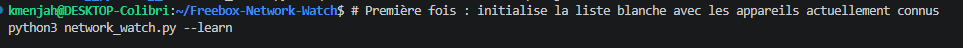
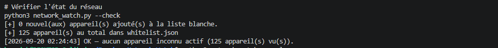

# 🏠🔍 Freebox Network Watch


---

Détecte les appareils **inconnus** connectés à un réseau domestique (Freebox), sans matériel
dédié ni service permanent — un script qu'on lance à la demande, pas une sonde 24/7.

## 🎯 Objectif

Savoir si un appareil que je ne reconnais pas se connecte à mon réseau WiFi/Ethernet, en
s'appuyant sur l'API officielle Freebox OS (liste des appareils vus par le routeur) plutôt que
sur une capture de trafic — pas de port mirroring disponible sur une Freebox Delta, donc pas
d'inspection de paquets ici (voir [Limites](#-limites--roadmap) plus bas).

## ⚙️ Fonctionnement

1. **`--learn`** : interroge la Freebox, ajoute tous les appareils actuellement connus à une
   liste blanche locale (`whitelist.json`, adresses MAC).
2. **`--check`** : ré-interroge la Freebox, compare chaque appareil **actif** à la liste
   blanche, et signale tout ce qui n'y figure pas.

Aucun service permanent requis — chaque exécution est indépendante, à lancer quand on veut
vérifier l'état du réseau.

## 📚 Structure du projet

```
Freebox-Network-Watch/
├── network_watch.py       # script principal (--learn / --check)
├── requirements.txt
├── .env.example           # modèle de config (générique, committé)
├── .env                   # config réelle : hôte/port de TA box (généré localement, gitignoré)
├── whitelist.example.json # modèle de liste blanche (adresses factices, committé)
├── whitelist.json         # liste blanche réelle (tes vraies adresses MAC, généré, gitignoré)
├── .freebox_token.json    # jeton d'autorisation Freebox (généré au 1er --learn, gitignoré)
├── logs/
│   └── check.log          # historique des exécutions cron (généré, gitignoré)
├── screenshots/
│   ├── terminal-learn.png
│   └── terminal-check.png
└── README.md
```

## 🧰 Prérequis

- Python 3.10+
- Une Freebox (testé sur Freebox Delta)
- Accès physique à la Freebox pour la première autorisation (voir ci-dessous)

## 🚀 Installation

```bash
git clone https://github.com/Anne-LaureS/Freebox-Network-Watch.git
cd Freebox-Network-Watch
pip install -r requirements.txt
cp .env.example .env
```

`.env` (jamais commité) contient l'adresse de connexion à ta box — les valeurs par défaut
(`mafreebox.freebox.fr:443`) fonctionnent pour la plupart des configurations réseau. Voir les
commentaires dans `.env.example` si ça ne fonctionne pas depuis ta machine (ex: sous WSL2).

## 🔐 Première autorisation

Au premier lancement, l'application demande l'accès à l'API Freebox — un message apparaît sur
l'écran LCD de la Freebox (ou dans l'app Freebox) qu'il faut valider manuellement. Le jeton
généré est stocké localement dans `.freebox_token.json` (jamais commité, voir `.gitignore`) et
réutilisé pour les exécutions suivantes.

## 📖 Usage

```bash
# Première fois : initialise la liste blanche avec les appareils actuellement connus
python3 network_watch.py --learn
```



```bash
# Vérifier l'état du réseau
python3 network_watch.py --check
```



Sortie type si tout est normal :
```
[2026-09-20 10:15:00] OK — aucun appareil inconnu actif (12 appareil(s) vu(s)).
```

Sortie type si un appareil inconnu est détecté (nom en rouge si l'appareil n'en a pas) :
```
[2026-09-20 10:15:00] ⚠️  1 appareil(s) INCONNU(S) détecté(s) :
  - INCONNU | MAC: 3C:5A:B4:xx:xx:xx | Espressif Inc. | IP: 192.168.1.87 | 1ère connexion: 2026-09-20 10:12:03 | dernière activité: 2026-09-20 10:14:51
```

Code de sortie `2` si un appareil inconnu est trouvé — permet de brancher `--check` sur une
tâche planifiée (cron) et de réagir sur le code retour (notification, log, etc.).

## ⏱️ Vérification automatique (cron)

```bash
crontab -e
```

Ajouter (vérifie toutes les 15 minutes, journalise dans `logs/check.log`) :
```
*/15 * * * * cd /chemin/vers/Freebox-Network-Watch && /usr/bin/python3 network_watch.py --check >> logs/check.log 2>&1
```

⚠️ Comme le reste de ce projet, ça ne tourne que quand la machine qui héberge le script est
allumée — pas un service permanent 24/7 sans matériel dédié toujours actif.

## ⚠️ Limites & roadmap

- **Basé sur ce que la Freebox voit, pas sur une capture de trafic réelle** — un appareil qui
  usurpe une adresse MAC de la liste blanche (spoofing) ne serait pas détecté. Une vraie
  inspection réseau demanderait un pont Suricata/Zeek en coupure (nécessite un Raspberry Pi ou
  équivalent, pas encore fait ici).
- **Pas de service permanent** : le script ne surveille que l'instant où il est exécuté — un
  appareil inconnu qui se connecte puis se déconnecte entre deux exécutions peut être manqué.
  Une exécution via cron toutes les N minutes réduit ce risque sans nécessiter de machine
  dédiée allumée en permanence.
- **V2 envisagée** : scan WiFi ponctuel en mode moniteur (Kismet/aircrack-ng via un adaptateur
  USB dédié) pour détecter les points d'accès pirates et les attaques de désauthentification —
  complémentaire à la détection d'appareils inconnus faite ici.
